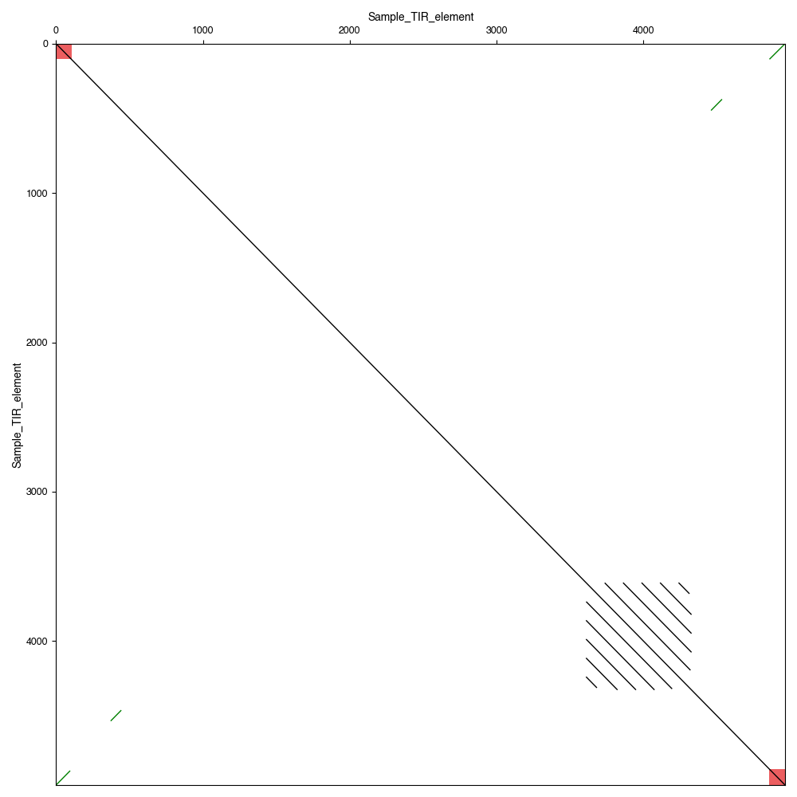

# CLI Tutorial

## Overview

The `tsplit` command is used to split transposable elements into their internal and external segments. It can be used for both long terminal repeats (LTRs) and terminal inverted repeats (TIRs).

The command line tools use sequence alignment to identify the boundaries of the segments based on user-defined parameters.

## Example usage

tSplit can be run in two modes: `tsplit LTR` and `tsplit TIR`, for extracting long terminal repeats or terminal inverted repeats, respectively.

Options are the same for each.

## tsplit TIR

### Basic TIR processing

For each element in _TIR_element.fa_ split into internal and external (TIR) segments.

Split segments will be written to _TIR_split_tsplit_output.fasta_ with suffix "\_I" for internal or "\_TIR" for external segments.

TIRs must be at least 10bp in length and share 80%
identity and occur within 10bp of each end of the input element.


```bash
tsplit TIR -i tests/data/TIR_element.fa -d results -p TIR_split

# Equivalet to defaults
tsplit TIR -i tests/data/TIR_element.fa -d results -p TIR_split --method blastn --maxdist 10 --minid 80.0 --minterm 10 --blast_evalue 0.001 --method blastn --splitmode split
```

Output: `results/TIR_split_tsplit_output.fasta`

### Report both TIRs

With `--splitmode external` only the outermost TIR is returned. Setting `--both` returns both TIRs, useful if not identical.

```bash
tsplit TIR -i tests/data/TIR_element.fa -d results -p TIR_external_both --splitmode external --both
```

### Generate annotated dotplot

```bash
tsplit TIR -i tests/data/TIR_element.fa -d results --splitmode split --blast_evalue 0.001 --minid 60.0 --paf --gff

flexidot -i tests/data/TIR_element.fa -a results/TIR_element.paf -m 2 -o results/blast_dotplot --gff results/TIR_element.gff3
```

Output:


## tsplit LTR

For each element in _LTR_retrotransposon.fa_ split into internal and external segments.

Split segments will be written to _LTR_split_tsplit_output.fasta_ with suffix "\_I" for internal or "\_LTR" for external segments.

LTRs must be at least 10bp in length and share 80% identity and occur within 10bp of each end of the input element.

```bash
tsplit LTR -i tests/data/LTR_retrotransposon.fa -p LTR_split
```

Output: LTR_split_tsplit_output.fasta
